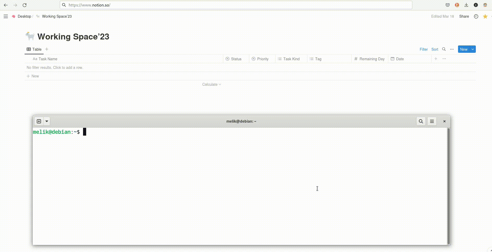

# notion-cli

Notion CLI is a command-line tool that allows you to interact with Notion, a popular productivity and note-taking application. This tool provides various functionalities to manage your tasks and pages within Notion.

## Installation
To install Notion CLI, follow these steps:
```bash
$ git clone git@github.com:ilkermeliksitki/notion-cli.git
```
Go to the project directory.
```bash
$ cd notion-cli
```
Install requirements
```bash
$ pip install -r requirements.txt
```
Make the `main.py` file executable.
```bash
chmod +x main.py
```
Create a bin directory (if it doesn't exist) and create symbolic link.
<br>
Do not forget to add `~/bin` to `PATH` if it is not defined.
```bash
$ mkdir -p ~/bin
$ ln -s /path/to/notion-cli/directory/main.py notion-cli
```
You need to create and environmental variable called `NOTIONDATABASEID`, which is the database id of notion. <a href="https://www.notion.so/help/intro-to-databases">look for database of notion</a>. You can get the database id after creating a "appropriate" database from its url.
<br><br>
Here is the url of a database: https://www.notion.so/03c4cd7c....578094d132?v=23456...fb3562. The database id of this database is 03c4cd7c....578094d132 is the url of the database
<br><br>
Secondly, you have to have another environmental variable called `NOTIONTOKEN`, which is the token of the integration. You can create a python integration from the following <a href="https://www.notion.so/my-integrations">my-integration page</a>
<br><br>
Most importantly, you have the following coloums in your database. `Task Name` (Text), `Status` (Select), `Priority` (Select), `Task Kind` (Multi Select), Tag (Multi Select), `Remaining Day` (Date). Otherwise, you will get an error.

## Usage


```bash
$ notion-cli --help
usage: notion-cli [-h] [-p {low,medium,high,overdue}] [-t TAG] [-s STATUS_NAME] [-d DATABASE_ID] [-k TASK_KIND] [-u]
                  [-a] [-l] [--change-date CHANGE_DATE] [--version]
                  [title]

Enables you to loosely interact with tokenized databases in notion.

positional arguments:
  title                 title of page (default: None)

options:
  -h, --help            show this help message and exit
  -p {low,medium,high,overdue}, --priority {low,medium,high,overdue}
                        sets priority of page (default: medium)
  -t TAG, --tag TAG     sets tag name of the task (default: study)
  -s STATUS_NAME, --status-name STATUS_NAME
                        status of task (default: not started)
  -d DATABASE_ID, --database-id DATABASE_ID
                        working space id, column names and types should be same. (default: None)
  -k TASK_KIND, --task-kind TASK_KIND
                        enables to categorize page task (default: daily productivity)
  -u, --update-remaining-day
                        updates remaining day column, which shows the remaining day of task (default: False)
  -a, --arrange-priorities
                        set `overdue`as a priority if you miss the deadline of tasks (default: False)
  -l, --list
  --change-date CHANGE_DATE
  --version             show program's version number and exit
```
## Examples
Adding a task about duolingo, with `task kind = language`, and `tag = italian`
<br>
The first word, `duolingo` in this case will determine the logo of the task <a href="https://www.notion.so/help/category/write-edit-and-customize">page</a>
```bash
$ notion-cli --task-kind language --tag italian 'duolingo - italian - 2 hours'
```
